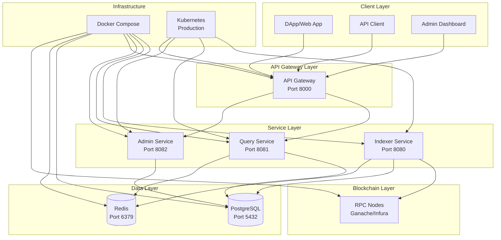

# System Architecture Diagram

## Overview

This document describes the high-level architecture of the Smart Contract Event Indexer system.

## Architecture Diagram



## Component Descriptions

### Client Layer
- **DApp/Web App**: Frontend applications consuming the API
- **API Client**: Direct API consumers (mobile apps, scripts)
- **Admin Dashboard**: Management interface for monitoring and configuration

### API Gateway Layer
- **API Gateway**: Single entry point for all external requests
  - Rate limiting
  - Authentication/Authorization
  - Request routing
  - Response aggregation

### Service Layer
- **Indexer Service**: Core blockchain monitoring and event indexing
  - Connects to RPC nodes
  - Monitors new blocks
  - Parses event logs
  - Stores events in database
  - Handles reorgs and confirmations

- **Query Service**: Optimized data querying
  - Caches frequently accessed data
  - Optimizes database queries
  - Provides fast response times

- **Admin Service**: Management and monitoring
  - Service health checks
  - Configuration management
  - Monitoring metrics
  - Alert management

### Data Layer
- **PostgreSQL**: Primary data storage
  - Event data
  - Contract configurations
  - Indexer state
  - User data

- **Redis**: Caching and pub/sub
  - Query result caching
  - Session storage
  - Event pub/sub
  - Rate limiting counters

### Blockchain Layer
- **RPC Nodes**: Blockchain connectivity
  - Ganache (development)
  - Infura/Alchemy (production)
  - Fallback nodes for reliability

## Data Flow

### Event Indexing Flow
1. Indexer Service polls RPC for new blocks
2. Fetches event logs for monitored contracts
3. Parses events using contract ABIs
4. Stores events in PostgreSQL
5. Updates indexer state
6. Publishes events to Redis (optional)

### Query Flow
1. Client sends query to API Gateway
2. Gateway routes to Query Service
3. Query Service checks Redis cache
4. If cache miss, queries PostgreSQL
5. Caches result in Redis
6. Returns response to client

### Admin Flow
1. Admin sends management request to API Gateway
2. Gateway routes to Admin Service
3. Admin Service updates configuration
4. Changes propagated to other services
5. Status returned to admin

## Technology Stack

### Backend Services
- **Language**: Go 1.21
- **Framework**: Custom microservices
- **Communication**: gRPC (internal), REST/GraphQL (external)

### Data Storage
- **Primary Database**: PostgreSQL 15
- **Cache**: Redis 7
- **Search**: Elasticsearch (future)

### Infrastructure
- **Development**: Docker Compose
- **Production**: Kubernetes
- **Monitoring**: Prometheus + Grafana
- **Logging**: ELK Stack

### Blockchain
- **Library**: go-ethereum
- **RPC**: WebSocket/HTTP
- **Networks**: Ethereum Mainnet, Testnets

## Scalability Considerations

### Horizontal Scaling
- Each service can scale independently
- Load balancers distribute traffic
- Database read replicas for queries
- Redis clustering for cache

### Vertical Scaling
- Indexer: High CPU for blockchain processing
- Query: High memory for caching
- Gateway: High network throughput

### Performance Optimization
- Connection pooling
- Query optimization
- Caching strategies
- Batch processing

## Security Considerations

### Network Security
- Internal service communication over private networks
- TLS for external API communication
- Rate limiting and DDoS protection

### Data Security
- Database encryption at rest
- Secure credential management
- Audit logging

### Access Control
- API authentication (JWT)
- Role-based access control
- Service-to-service authentication

## Monitoring and Observability

### Metrics
- Service health and performance
- Database query performance
- Blockchain connection status
- Error rates and response times

### Logging
- Structured logging with context
- Centralized log aggregation
- Error tracking and alerting

### Tracing
- Distributed tracing across services
- Request flow visualization
- Performance bottleneck identification

## Deployment Architecture

### Development
```
Docker Compose
├── indexer-service
├── query-service
├── admin-service
├── api-gateway
├── postgres
├── redis
└── ganache
```

### Production
```
Kubernetes Cluster
├── Namespace: event-indexer
│   ├── indexer-service (3 replicas)
│   ├── query-service (5 replicas)
│   ├── admin-service (2 replicas)
│   └── api-gateway (3 replicas)
├── Namespace: data
│   ├── postgres (primary + replicas)
│   └── redis (cluster)
└── Namespace: monitoring
    ├── prometheus
    ├── grafana
    └── elasticsearch
```

## Future Enhancements

### Planned Additions
- Elasticsearch for advanced search
- Kafka for event streaming
- Service mesh (Istio)
- Multi-chain support

### Performance Improvements
- Database sharding
- Advanced caching strategies
- CDN for static content
- Edge computing

---

**Last Updated**: 2025-10-17
**Version**: 1.0
**Status**: Implemented
